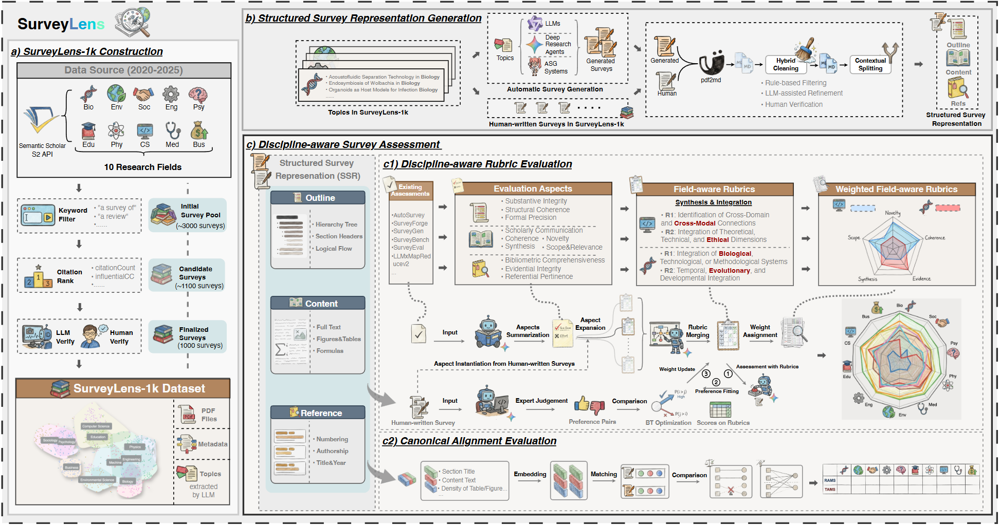
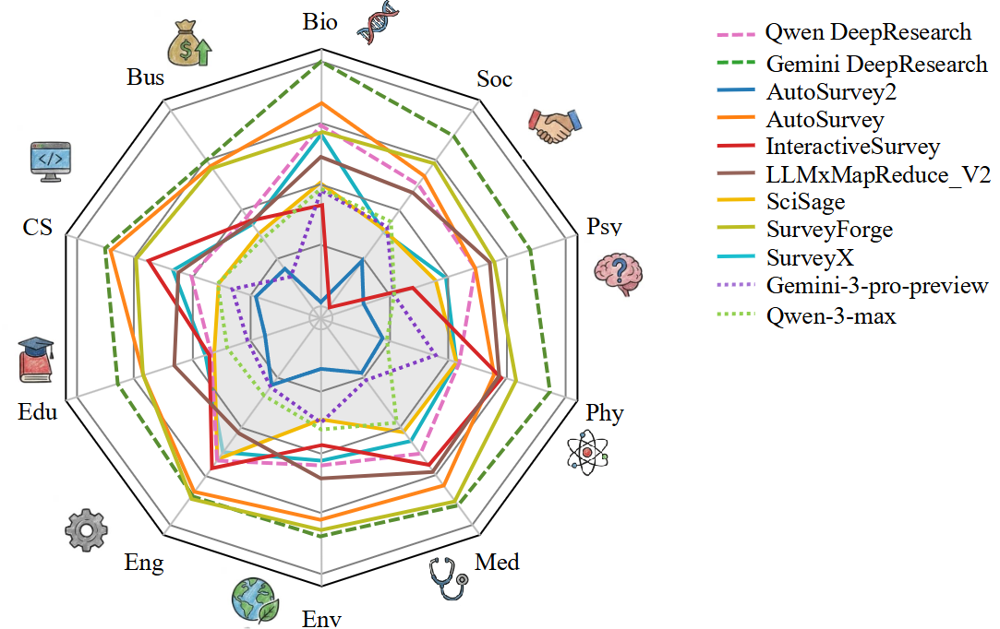

# SurveyLens

*A Discipline-Aware Benchmark for Evaluating Automatic Survey Generation*

## Overview

The exponential growth of scientific literature has driven the evolution of Automatic Survey Generation (ASG) from simple pipelines to multi-agent frameworks and commercial Deep Research agents. However, current ASG evaluation methods rely on generic metrics and are heavily biased toward Computer Science (CS), failing to assess whether ASG methods adhere to the distinct standards of various academic disciplines. Consequently, researchers, especially those outside CS, lack clear guidance on using ASG systems to yield high-quality surveys compliant with specific discipline standards.

**SurveyLens** is the first discipline-aware benchmark for evaluating ASG methods across diverse research disciplines. We construct **SurveyLens-1k**, a curated dataset of 1,000 high-quality human-written surveys spanning 10 disciplines, and propose a dual-lens evaluation framework:

1. **Discipline-Aware Rubric Evaluation** — Utilizes LLMs with human preference-aligned weights to assess adherence to domain-specific writing standards.
2. **Canonical Alignment Evaluation** — Rigorously measures content coverage and synthesis quality against human-written survey papers via embedding similarity.

We conduct extensive experiments evaluating 11 state-of-the-art ASG methods on SurveyLens, including Vanilla LLMs, ASG systems, and Deep Research agents. Our analysis reveals the distinct strengths and weaknesses of each paradigm across fields, providing essential guidance for selecting tools tailored to specific disciplinary requirements.


*Figure 1: The SurveyLens dual-lens evaluation framework. Our approach combines (1) Discipline-Aware Rubric Evaluation with human preference-aligned weighting, and (2) Canonical Alignment Evaluation via embedding-based similarity metrics.*

## Dataset

**SurveyLens-1k** contains 1,000 curated, high-quality human-written survey papers spanning 10 academic disciplines (100 surveys each):

| Biology | Business | Computer Science | Education | Engineering | Env. Science | Medicine | Physics | Psychology | Sociology |
|:---:|:---:|:---:|:---:|:---:|:---:|:---:|:---:|:---:|:---:|
| 100 | 100 | 100 | 100 | 100 | 100 | 100 | 100 | 100 | 100 |

**Download:** The full dataset is available on [Google Drive](https://drive.google.com/file/d/1Fr9j_IvQ1BoOM2BEEqnkSgPbKdSV9xFJ/view?usp=sharing).

After downloading, extract the data and place the survey files into the `results/original/` directory.

## Project Structure

```
SurveyLens/
├── scripts/
│   ├── config/                        # Pipeline configuration files
│   │   ├── data_processing_config.json
│   │   ├── eval_qualitative_config.json
│   │   ├── eval_quantitative_config.json
│   │   ├── eval_preference_config.json
│   │   ├── bt_config.json
│   │   ├── apply_bt_weights_config.json
│   │   └── ablation_config.json
│   ├── evaluation/                    # Evaluation scripts
│   │   ├── eval_qualitative.py
│   │   ├── eval_quantitative.py
│   │   ├── eval_preference.py
│   │   ├── eval_ablation.py
│   │   ├── bt.py
│   │   ├── apply_bt_weights.py
│   │   ├── analyze_results.py
│   │   └── merge_results.py
│   ├── guideline_generation/         # Discipline-specific criteria generation
│   │   ├── aggregate_aspects.py
│   │   ├── expand_aspects.py
│   │   └── merge_aspects.py
│   ├── utils/                        # Utility modules
│   │   └── markdown_to_json.py
│   └── data_processing_pipeline.py   # Data preprocessing pipeline
├── outputs/
│   ├── criteria/                     # Discipline-specific evaluation criteria
│   └── surveys/                      # Sample human-written survey papers
├── results/
│   ├── original/                     # Raw survey outputs (organized by system)
│   ├── processed/                    # Processed JSON surveys
│   └── evaluation/                   # Evaluation results
├── LICENSE
└── README.md
```

## Installation

### Requirements

- Python 3.8+
- An OpenAI-compatible LLM API endpoint (for qualitative/preference evaluation)
- An embedding API endpoint (for quantitative evaluation)

### Setup

```bash
pip install openai python-dotenv chromadb numpy scipy tqdm
```

Create a `.env` file in the project root with your API credentials:

```env
API_KEY=your_llm_api_key
BASE_URL=https://your-llm-api-endpoint/v1

# For quantitative evaluation (embedding-based)
EMBEDDING_API_KEY=your_embedding_api_key
EMBEDDING_API_BASE=https://your-embedding-api-endpoint/v1
```

## Pipeline Guide

The evaluation pipeline consists of 7 steps, each controlled by a configuration file in `scripts/config/`. All scripts are run from the project root directory.

### Step 1: Data Processing

**Config:** `scripts/config/data_processing_config.json`

Converts raw markdown survey files into structured JSON format. Normalizes outlines, content sections, and references. Optionally performs LLM-based calibration and quality checks.

```bash
python scripts/data_processing_pipeline.py --config scripts/config/data_processing_config.json
```

Key configuration options:
| Parameter | Description |
|---|---|
| `input_dir` | Directory containing raw survey files (default: `results/original`) |
| `output_dir` | Output directory for processed JSON (default: `results/processed`) |
| `normalize_outline` | Normalize heading hierarchy |
| `normalize_content` | Clean and normalize section content |
| `normalize_references` | Standardize reference entries |
| `llm_quality_check` | Enable LLM-based reference quality checking |
| `llm_model` | LLM model for calibration tasks |

### Step 2: Qualitative Evaluation (Discipline-Aware Rubric)

**Config:** `scripts/config/eval_qualitative_config.json`

Evaluates survey quality using discipline-specific criteria and LLM scoring. Loads domain-specific rubrics from `outputs/criteria/` and scores each survey on outline, content, and reference quality at per-aspect and per-criterion granularity.

```bash
python scripts/evaluation/eval_qualitative.py --config scripts/config/eval_qualitative_config.json
```

Key configuration options:
| Parameter | Description |
|---|---|
| `processed_dir` | Input directory of processed surveys |
| `criteria_base_dir` | Directory containing discipline-specific criteria |
| `criteria_filename` | Criteria JSON filename (default: `merged_aspects.json`) |
| `per_aspect_scoring` | Enable per-aspect scoring |
| `per_criterion_scoring` | Enable per-criterion scoring |
| `llm_model` | LLM model for evaluation |
| `max_total_tokens_in_prompt` | Maximum tokens per evaluation prompt |

### Step 3: Quantitative Evaluation (Canonical Alignment)

**Config:** `scripts/config/eval_quantitative_config.json`

Measures how closely system-generated surveys align with human-written surveys using embedding similarity. Embeds outline entries, content sections, and references into a ChromaDB vector store, then computes alignment metrics.

```bash
python scripts/evaluation/eval_quantitative.py --config scripts/config/eval_quantitative_config.json
```

Key configuration options:
| Parameter | Description |
|---|---|
| `embedding_model` | Embedding model name |
| `embedding_api_base` | Embedding API endpoint |
| `chroma_db_dir` | ChromaDB persistence directory |
| `use_ams` | Enable Average Maximum Similarity |
| `use_bms` | Enable Bidirectional Matching Score |
| `use_hungarian_matching` | Enable Hungarian matching for optimal alignment |
| `outline_threshold` / `content_threshold` / `reference_threshold` | Similarity thresholds |

### Step 4: Preference Evaluation

**Config:** `scripts/config/eval_preference_config.json`

Performs pairwise LLM comparison of surveys within a single system (e.g., Human) per discipline. For each discipline, all surveys are compared pairwise and ranked using ELO scoring. Supports double round-robin (evaluating both A vs B and B vs A orderings).

```bash
python scripts/evaluation/eval_preference.py --config scripts/config/eval_preference_config.json
```

Key configuration options:
| Parameter | Description |
|---|---|
| `input_dir` | Directory containing surveys to compare (e.g., `results/processed/Human`) |
| `double_round_robin` | Compare in both orders to reduce position bias |
| `initial_elo` | Starting ELO rating (default: 1500) |
| `k_factor` | ELO K-factor (default: 32) |
| `eval_outline` / `eval_content` / `eval_reference` | Which components to evaluate |
| `llm_model` | LLM model for pairwise comparison |

### Step 5: Bradley-Terry Weight Fitting

**Config:** `scripts/config/bt_config.json`

Fits aspect weights from pairwise preference data using the Bradley-Terry model. Determines which scoring aspects (from Step 2) are most predictive of human/LLM preferences (from Step 4). Fits separate models per component (outline, content, reference) and optionally per domain.

```bash
python scripts/evaluation/bt.py --config scripts/config/bt_config.json
```

Key configuration options:
| Parameter | Description |
|---|---|
| `preference_eval_file` | Path to preference evaluation results (from Step 4) |
| `evaluation_summary_file` | Path to qualitative evaluation summary (from Step 2) |
| `system` | System whose surveys were compared (default: `Human`) |
| `components` | Components to fit (default: `[outline, content, reference]`) |
| `feature_level` | Granularity: `aspect`, `criterion`, or `both` |
| `fitting_mode` | Fitting scope: `domain`, `global`, or `both` |
| `regularization_alpha` | L2 regularization strength |
| `augment_with_criteria` | Enable criterion-expansion data augmentation |

### Step 6: Apply BT Weights

**Config:** `scripts/config/apply_bt_weights_config.json`

Applies the learned BT weights (from Step 5) to rescore evaluation summaries for any system. Produces a comparison of original (equal-weight) scores vs. BT-weighted scores, along with ranking changes.

```bash
python scripts/evaluation/apply_bt_weights.py --config scripts/config/apply_bt_weights_config.json
```

Key configuration options:
| Parameter | Description |
|---|---|
| `bt_weights_file` | Path to BT weights JSON (from Step 5) |
| `evaluation_summary_files` | List of evaluation summary files to rescore |
| `weight_level` | Which weight level to apply: `aspect`, `criterion`, or `both` |
| `compute_aspect_from_criterion` | Recompute aspect scores from criterion scores |

### Step 7: Ablation Evaluation

**Config:** `scripts/config/ablation_config.json`

Runs an ablation study using generic (non-discipline-aware) rubrics. Instead of the discipline-specific criteria used in Step 2, this uses a fixed set of rubrics: Coverage, Structure, Relevance, Language, Criticalness, Outline, and Reference.

```bash
python scripts/evaluation/eval_ablation.py --config scripts/config/ablation_config.json
```

Configuration options are the same as Step 2, but the built-in fixed rubrics are used instead of discipline-specific criteria.

## Analysis & Merging

After running evaluations, use the following scripts to aggregate and analyze results:

**Aggregate results into CSVs:**

```bash
python scripts/evaluation/analyze_results.py <evaluation_summary.json> --output-dir results/analysis/
```

**Merge multiple analysis runs (mean/std):**

```bash
python scripts/evaluation/merge_results.py results/analysis/analysis_1/ results/analysis/analysis_2/ --output-dir results/analysis/merged/
```

## Evaluated Systems

SurveyLens evaluates the following ASG methods:

| System | Type |
|---|---|
| Human | Human-written surveys (ground truth) |
| Qwen | Vanilla LLM & Deep Research Agent |
| Gemini | Vanilla LLM & Deep Research Agent |
| AutoSurvey | ASG System |
| AutoSurvey2 | ASG System |
| InteractiveSurvey | ASG System |
| LLMxMapReduce_V2 | ASG System |
| SciSage | ASG System |
| SurveyForge | ASG System |
| SurveyX | ASG System |


*Figure 2: Radar chart comparing ASG methods across key dimensions. The visualization reveals distinct strengths and weaknesses of each paradigm—Vanilla LLMs, specialized ASG systems, and commercial Deep Research agents—across different evaluation criteria.*

## License

This project is licensed under the MIT License. See the [LICENSE](LICENSE) file for details.
